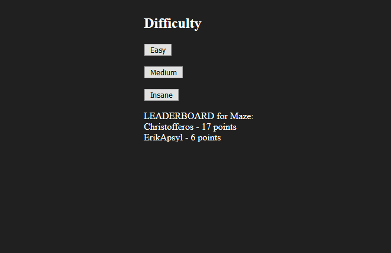
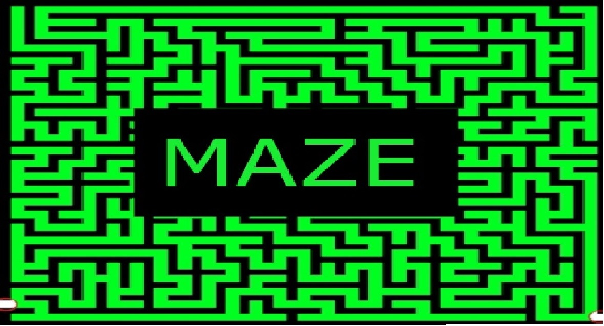
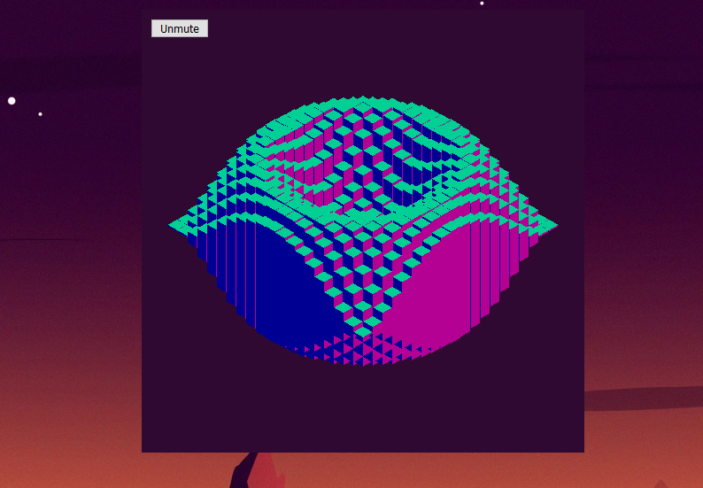
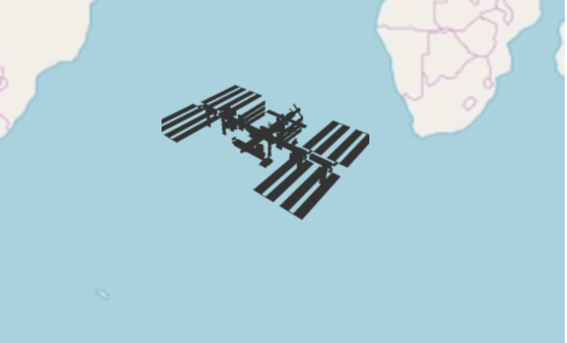
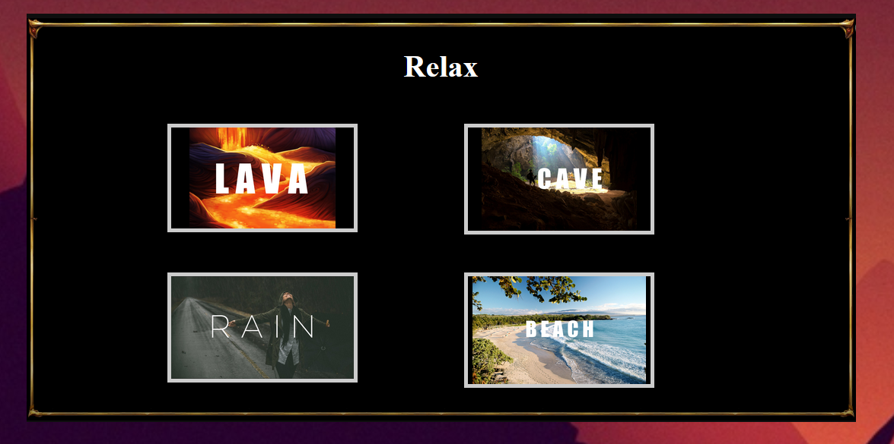

# Foxdrop
Link to website:
https://foxdrop.000webhostapp.com/

## Project Description
On Foxdrop there are games to play and animations to watch. A database is used to store user information, highscores and to reset passwords. Users may sign up to get access to game leaderboards and to view a leaderboard accessed from the League of Legends REST API.

## Project Goals
Website should function as a place for people to visit and enjoy some animations and games. If they want, they can attempt to beat their own or other peoples' high scores in the games for fun or competition.

The website should follow these <b>10 heuristics as specified by Jakob Nielsen:

<b>
Visibility of system status  
Match between system and the real world  
User control and freedom  
Consistency and standards  
Error prevention  
Recognition rather than recall  
Flexibility and efficiency of use  
Aesthetic and minimalist design  
Help users recognize, diagnose, and recover from errors  
Help and documentation  
 

More information about these heuristics:  
https://www.nngroup.com/articles/ten-usability-heuristics/

<h1> Features:

<h2> Database functionalities    

Registration:

Login:  

Logged in:  

Collection of high scores:  

Forgotten password, tokens, mail server:

 
 
 

<h2> Games:  

Maze Solver  

Tic Tac Toe  

Snake  

Pong  

 
 
 

<h2> Web Animations:  

Space Lightspeed Travel:

Eagle's perspective while flying above mountains:

Cube with an endless harmonic motion:

International Space Station API real time location:

Audio visualisation (amplitude of volume):

Relaxing nature sound effects:

